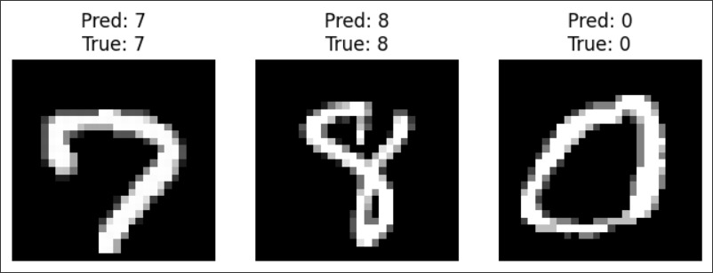
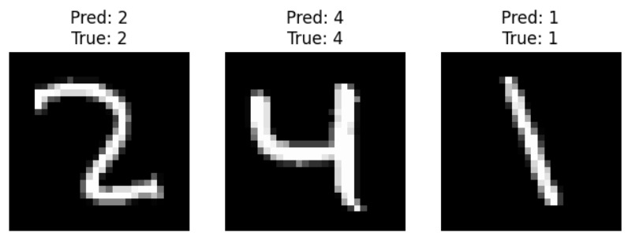

# 🖊️ MNIST Digit Recognition with PyTorch

This project implements a **handwritten digit recognition system** using the [MNIST dataset](http://yann.lecun.com/exdb/mnist/) and **PyTorch**. It demonstrates the complete workflow: **loading data, building & training a neural network, saving model weights, reloading them, and visualizing predictions** in Google Colab.

---

## 📊 Dataset

* **Dataset:** MNIST (Modified National Institute of Standards and Technology)
* **Images:** 70,000 grayscale images of digits (0–9)

  * Training: 60,000
  * Testing: 10,000
* **Image size:** 28 × 28 pixels
* **Download:** Automatically handled with `torchvision.datasets.MNIST`

---

## ⚙️ Requirements

To run this project, install the following dependencies:

```bash
pip install torch torchvision matplotlib
```
---

## 🚀 Quick Usage

1. Clone the repository:

```bash
git clone https://github.com/your-username/MNIST-Digit-Recognition-PyTorch.git
cd MNIST-Digit-Recognition-PyTorch
```

2. Open `notebook.ipynb` in Google Colab and run the cells to train/evaluate the model.

3. To use pretrained weights (skip training):

```python
import torch
from model import MNISTModel

device = torch.device("cuda" if torch.cuda.is_available() else "cpu")
model = MNISTModel().to(device)
model.load_state_dict(torch.load("models/digit_recognition_0.pth", map_location=device))
model.eval()
```

---

## 📈 Results

Predictions of the Model:
```markdown


```

---

## 🗂️ Project Structure

```
MNIST-Digit-Recognition/
│── notebook.ipynb                   # Main training/testing notebook
│── models/                          # Saved weights
│   └── digit_recognition_0.pth
│── README.md                        # This file
│── images/                          # Example output images for README
```

---
